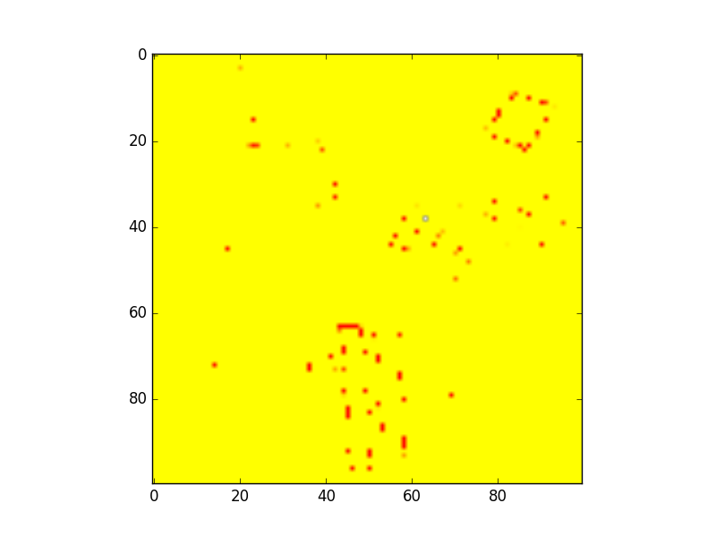
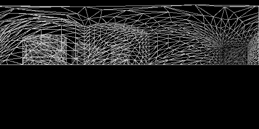

# Usage
1. Compile the main project
2. Compile the compute shader to SPIR-V using the Khronos [GlslangValidator](https://cvs.khronos.org/svn/repos/ogl/trunk/ecosystem/public/sdk/tools/glslang/Install/)
3. Run the generic analysis `quavis-generic-service` where
 * `-a` is the maxium angle in radians
 * `-r` is the maximum visible distance
 * `-s` is the first-stage compute shader (aggregating row-wise)
 * `-t` is the second-stage compute shader (aggregating column-wise)
 * `-f` is the geojson file to be analysid
 * `-d 1` set to 1 to store debug images into `images/` folder. Note that the results become wrong in this mode
 * `-l 1` set to 1 to store the images with lines-only (no filling)
 * `-u <n>` set to 1 to print timings instead of results
 * `-x` the width
 * `-w` the workgroups
 * `-G 1` to disable the geom-shader
 * `-T 1` to disable the tess-shader
 * *stdin* is the list of observation points in the format
```
x1 y1 z1
x2 y2 z2
...
```

# Example
```
cd examples
glslangValidator -V shaders/shader.area.comp -o shaders/shader.area.comp.spv
glslangValidator -V shaders/shader.2.area.comp -o shaders/shader.2.area.comp.spv
../bin/quavis-generic-service -a 0.1 -r 10000.0 -s "shaders/shader.area.comp.spv" -t "shaders/shader.2.area.comp.spv" -f "data/empower-shack.geojson" < data/empower-shack-grid.txt
```

## Isovist Map (created using map.py)



## Debug Images

Using line-mode or debug-mode yields the following depth images for an observation inside of a building:

### Depth-Image (Debug):


### Depth-Image in Line-Mode:


